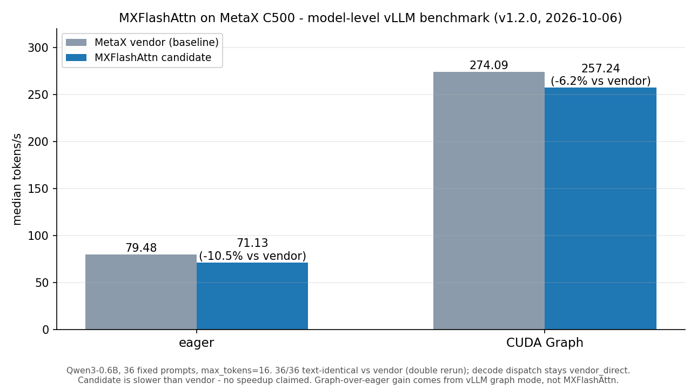

# MXFlashAttn

> **Status (2026-10-06): v1.2.0 has completed its C500 rerun acceptance.**
> Dispatch order is **vendor_direct (MetaX wheel) → mxmac_aten_correctness (in-repo ATen extension) → reference (opt-in)**.
> v1.2.0 fixes a silent import fallback in the vLLM plugin (the MetaX vendor backend class is named `MacaFlashAttentionBackend`; importing it under the upstream name raised ImportError and silently fell back to the upstream vLLM implementation). After the fix, model-level correctness passed 36/36 with a double rerun.

[](https://github.com/leo1852098393-blip/MXFlashAttn/actions/workflows/ci.yml)
[](LICENSE)
[](pyproject.toml)

**[中文](README.md)** · English

MXFlashAttn provides FlashAttention-compatible forward APIs and an inference adapter for **MXMACA / MetaX C500**. It covers dense, variable-length, and KV-cache APIs with explicit backend selection, observable fallback behavior, and reproducible C500 benchmarks.

> Project position: deliver a runnable, verifiable, and reproducible domestic-accelerator adapter first. The in-repository C++ extension is a PyTorch ATen bring-up/correctness path, not a project-authored fused FlashAttention kernel. Optimized C500 execution currently relies on a matching MetaX `flash-attn` wheel.

## Verified Results (v1.2.0, measured on C500, 2026-10-06)

| Metric | Result |
| --- | --- |
| v0.9 fair operator matrix | 36/36 C500 cases completed; same-input comparison across reference, Torch SDPA, MetaX vendor, and MXFlashAttn API |
| MXFlashAttn API vs reference | 60.52% median latency reduction (v0.9 C500 matrix) |
| MXFlashAttn API vs MetaX vendor (raw) | 25.45% median latency increase (wrapper overhead, disclosed as-is; no vendor-speedup claim; the v0.9 matrix measured +32.74%) |
| Model-level eager (Qwen3-0.6B, 36 paired prompts) | vendor median 79.48 tokens/s, candidate median 71.13 tokens/s (10.5% slower), 36/36 text-identical |
| Model-level CUDA Graph (same suite, double rerun) | vendor median 274.09 tokens/s, candidate median 257.24–258.19 tokens/s (about 6% slower), 36/36 text-identical |
| Decode dispatch evidence | `vendor_direct` throughout (840/840 samples in `official-split-rc.json`); prefill delegated to vendor |
| Maximum absolute error | 0.00390625 (v0.9 MXFlashAttn API vs reference) |
| Automated tests | 43 passed |

Operator-level numbers come from the same-input fair matrix, not end-to-end generation. No operator-level case is faster than the raw MetaX vendor call — the remaining gap is wrapper overhead. Model-level vendor and candidate results are kept in separate columns and never mixed into operator medians. The CUDA-graph-over-eager gain comes from vLLM graph mode itself (both sides scale up together) and is not attributed to MXFlashAttn. Raw data: `artifacts/official-split-fixed-36.json`, `artifacts/official-split-clean-36.json` (candidate), `artifacts/base-graph-36.json` (vendor graph baseline), `artifacts/fair-matrix-c500.json` (operator level), `artifacts/official-split-rc.json` (dispatch sampling).

## Capability Matrix

| Capability | Status |
| --- | --- |
| FP16 / BF16 forward | Verified on C500 |
| Head dimensions 64 / 128 | Verified on C500 |
| GQA / MQA and causal attention | Verified on C500 |
| Varlen, dense KV cache, and paged KV cache | APIs implemented; paged KV append verified on C500 |
| PyTorch reference fallback | Available only when explicitly enabled |
| Backward, FP8, and multi-card | Not supported in the first release |
| vLLM backend and model candidate | Qwen3-0.6B generation has `mxflashattn_decoder` dispatch evidence; prefill remains vendor-backed |

See [`docs/support-matrix.md`](docs/support-matrix.md) for detailed boundaries and evidence.

## Installation

On C500, install the MXMACA vendor PyTorch build and the MetaX `flash-attn` wheel matching the driver/runtime first. The verified provider is `flash-attn 2.6.3+metax3.5.3.9torch2.8`; a generic CUDA wheel is not selected as the MXMACA provider.

```bash
python -m pip install -r requirements-c500.txt
python -m pip install --no-build-isolation -e .
```

For development and the local reference suite:

```bash
python -m pip install -e ".[dev]"
python -m pytest
```

To build the in-repository ATen extension and force it for hardware validation:

```bash
MXFLASHATTN_BUILD_NATIVE=1 python -m pip install --no-build-isolation -e .
MXFLASHATTN_BACKEND=aten python -m pytest -q
```

## API Example

The public functions are:

- `flash_attn_func`
- `flash_attn_varlen_func`
- `flash_attn_with_kvcache`

Dense Q/K/V tensors use `[batch, sequence, heads, head_dim]` layout. Head dimensions 64 and 128 are supported:

```python
import torch
from mxflashattn import flash_attn_func, get_last_dispatch_info

q = torch.randn(1, 32, 8, 64, dtype=torch.float16, device="cuda")
k = torch.randn(1, 128, 2, 64, dtype=q.dtype, device=q.device)
v = torch.randn_like(k)
out = flash_attn_func(q, k, v, causal=True)
print(get_last_dispatch_info())
```

Calls fail by default when neither a MetaX provider nor the compiled extension is available. Enable the PyTorch reference fallback explicitly:

```bash
export MXFLASHATTN_ALLOW_FALLBACK=1
```

Fallback emits a `RuntimeWarning` and records its reason through `get_last_dispatch_info()` and the benchmark report. Dropout, local windows, ALiBi, soft-capping, rotary embeddings, backward, and softmax-LSE returns fail explicitly rather than producing silent incorrect results.

## Benchmark

The v0.9 fair matrix uses a fixed seed across 36 combinations of batch size, query length, KV length, head dimension, GQA ratio, dense/varlen/paged layout, dtype, and causal mode. Reproduce the C500 run with:

```bash
python -m benchmarks.run \
  --config benchmarks/configs/c500.yaml \
  --device cuda --count 36 --repeats 3 \
  --output artifacts/fair-matrix-c500.json
python benchmarks/fair_report.py artifacts/fair-matrix-c500.json \
  --vendor-model artifacts/qwen-vendor-baseline.json \
  --candidate-model artifacts/c500-qwen-candidate-suite.json \
  --output artifacts/fair-matrix-c500.md
```

Each case records error, tokens/s, prefill/decode latency, peak memory, backend, fallback reason, and PyTorch/MXMACA/driver/vLLM versions. Model-level first-token latency is outside this operator benchmark and requires a separate generation experiment.



> The earlier chart `c500-speedup-summary.png` (384 cases vs the PyTorch reference) is historical data kept under `docs/results/` only; it is not a current performance claim.

## vLLM and Model Demo

The integration directory contains a vLLM 0.17.0 bridge. A four-request Qwen3-0.6B suite on C500 produced text and recorded `mxflashattn_decoder` dispatch events; one-token decoder execution is handled by MXFlashAttn while prefill is explicitly delegated to the MetaX vendor path. TTFT remains null because the vLLM 0.17.0 offline interface did not expose timestamps. See [`artifacts/E2E_REPORT.md`](artifacts/E2E_REPORT.md).

The planned smoke-test models are listed below; weights are never committed to this repository:

- `Qwen/Qwen2.5-1.5B-Instruct`
- `Qwen/Qwen2.5-7B-Instruct`

## Repository Layout

```text
mxflashattn/       Python APIs, validation, reference, and dispatch
csrc/mxmac/        C++/ATen bring-up extension
integrations/vllm/ vLLM bridge and preflight checks
benchmarks/        Fixed YAML configs, runner, and reporting tools
docs/results/      C500 raw results, report, and chart
tests/             CPU/reference and conditional C500 tests
```

## Roadmap

1. Add external TTFT timing for vLLM 0.17.0 and test more compatible versions.
2. Reduce the gap between the MXFlashAttn API and the MetaX vendor without converting reference gains into vendor claims.
3. Evaluate backward, FP8, multi-card, and SGLang support as separate milestones.

## License

This project is licensed under the [Apache License 2.0](LICENSE). MXMACA runtime, vendor PyTorch, MetaX wheels, vLLM, model weights, and datasets retain their own licenses.

Contributions are welcome through [`CONTRIBUTING.md`](CONTRIBUTING.md).
