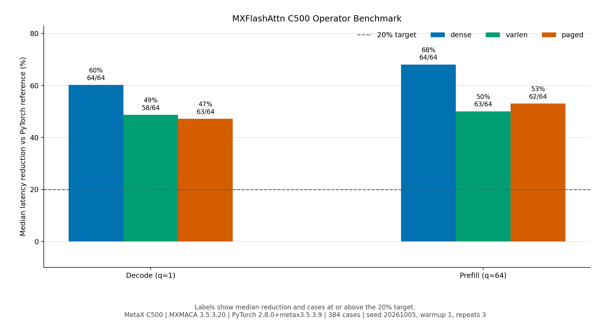

# MXFlashAttn

> **状态（2026-10-06）：v1.2.0 已在 C500 上完成复跑验收。**
> 本分支 dispatch 顺序为 **vendor_direct（MetaX wheel）→ mxmac_aten_correctness（仓库 ATen 扩展）→ reference（需显式开启）**。
> v1.2.0 修复了 vLLM 插件的静默 import 回退（MetaX vendor 后端类名为 `MacaFlashAttentionBackend`，此前按上游类名导入抛 ImportError 后回退到上游 vLLM 实现），修复后模型级正确性 36/36 双复跑验收通过。

[](https://github.com/leo1852098393-blip/MXFlashAttn/actions/workflows/ci.yml)
[](LICENSE)
[](pyproject.toml)

中文说明 · **[English](README.en.md)**

MXFlashAttn 是面向 **MXMACA / MetaX C500** 的 FlashAttention 兼容前向算子与推理适配项目。项目提供 dense、varlen 和 KV cache API，支持显式后端选择、可追踪的 fallback 行为，以及可复现的 C500 benchmark。

> 项目定位：可运行、可验证、可复现的国产算力适配层。
> `csrc/mxmac/` 里的 C++ 扩展是 **PyTorch ATen bring-up / 正确性对照路径**，由 `at::matmul` + `softmax` 组装的朴素 O(n²) 实现，**不是自研融合 FlashAttention kernel，也不含任何 MACA device kernel**。
> C500 上的优化执行依赖 MetaX `flash-attn` wheel，本项目不把该路径表述为自研算子。

## 已验证结果（v1.2.0 C500 实测，2026-10-06）

| 指标 | 结果 |
| --- | --- |
| 算子级公平矩阵 | C500 36/36 组完成；reference、Torch SDPA、MetaX vendor、MXFlashAttn API 同输入对比 |
| MXFlashAttn API vs PyTorch reference | 中位延迟下降 60.52% |
| MXFlashAttn API vs MetaX vendor 裸调 | 中位延迟**上升 25.45%**（wrapper 开销，如实披露，不宣称对 vendor 加速；v0.9 矩阵实测为 +32.74%） |
| 模型级 eager（Qwen3-0.6B，36 prompt 配对） | vendor 中位 79.48 tokens/s，candidate 中位 71.13 tokens/s（慢 10.5%），**36/36 文本一致** |
| 模型级 CUDA Graph（同上，双复跑） | vendor 中位 274.09 tokens/s，candidate 中位 257.24–258.19 tokens/s（慢约 6%），**36/36 文本一致** |
| decode dispatch 证据 | 全程 `vendor_direct`（`official-split-rc.json` 840/840 采样），prefill 委托 vendor |
| 最大绝对误差 | 0.00390625（v0.9，MXFlashAttn API vs reference） |
| 自动化测试 | 43 passed |

三条必须同时说清的口径：

1. **算子级基线是同输入同设备的公平矩阵**（reference / torch SDPA / MetaX vendor / MXFlashAttn API 四路对比），不是拿自写 reference 单独对比得出的加速比。MXFlashAttn API 相对 vendor 裸调的差距是 wrapper 开销，**没有任何一组算子级用例快于 vendor 裸调**。
2. **仓库早期那组 384 用例 benchmark（decode 中位下降 51.64%、185/192 达标）基线是本项目 PyTorch reference**，已被公平矩阵取代，仅作为历史数据保留在 `docs/results/`，不作为当前性能主张。
3. **模型级 vendor 与 candidate 分栏列示，不混入算子级 median**；v1.0 的 candidate 曾慢于 vendor 约 39.7%，v1.2.0 修复静默 import 回退后收敛到 eager 慢 10.5% / graph 慢约 6%，且 36 条 prompt 文本全部与 vendor 一致。CUDA Graph 相对 eager 的提升来自 vLLM 图模式本身，两边同涨，不归因于 MXFlashAttn。

原始数据：模型级 `artifacts/official-split-fixed-36.json`、`artifacts/official-split-clean-36.json`（candidate），`artifacts/base-graph-36.json`（vendor graph baseline）；算子级 `artifacts/fair-matrix-c500.json`；dispatch 采样 `artifacts/official-split-rc.json`。

## 能力矩阵

| 能力 | 状态 |
| --- | --- |
| FP16 / BF16 forward | C500 已验证 |
| Head dimension 64 / 128 | C500 已验证 |
| GQA / MQA、causal | C500 已验证 |
| varlen、dense KV cache、paged KV cache | API 已实现；paged KV append 已在 C500 验证 |
| dispatch 后端 | `vendor_direct`（MetaX wheel）→ `mxmac_aten_correctness`（ATen 扩展）→ `reference`（显式开启） |
| PyTorch reference fallback | 需显式设置 `MXFLASHATTN_ALLOW_FALLBACK=1`，不会静默切换 |
| vLLM backend 与模型级 candidate | Qwen3-0.6B 生成有 `mxflashattn_decoder` dispatch 证据；prefill 明确委托 vendor |
| TTFT | 未测量（vLLM 0.17.0 离线接口未提供时间戳，尚未做外部计时） |
| backward、FP8、多卡 | 首期不支持 |
| SGLang | 未安装验证 |

详细边界见 [`docs/support-matrix.md`](docs/support-matrix.md)。

## 安装

C500 必须先安装与驱动匹配的 MXMACA vendor PyTorch 和 MetaX `flash-attn` wheel。当前验证版本为 `flash-attn 2.6.3+metax3.5.3.9torch2.8`，通用 CUDA wheel 不会被当作 MXMACA provider。

```bash
python -m pip install -r requirements-c500.txt
python -m pip install --no-build-isolation -e .
```

开发依赖和本地 reference 测试：

```bash
python -m pip install -e ".[dev]"
python -m pytest
```

如需构建仓库内 ATen 扩展并强制使用它进行硬件验证：

```bash
MXFLASHATTN_BUILD_NATIVE=1 python -m pip install --no-build-isolation -e .
MXFLASHATTN_BACKEND=aten python -m pytest -q
```

## API 示例

公开接口为：

- `flash_attn_func`
- `flash_attn_varlen_func`
- `flash_attn_with_kvcache`

dense Q/K/V 使用 `[batch, sequence, heads, head_dim]` 布局，当前支持 head dimension 64 和 128：

```python
import torch
from mxflashattn import flash_attn_func, get_last_dispatch_info

q = torch.randn(1, 32, 8, 64, dtype=torch.float16, device="cuda")
k = torch.randn(1, 128, 2, 64, dtype=q.dtype, device=q.device)
v = torch.randn_like(k)
out = flash_attn_func(q, k, v, causal=True)
print(get_last_dispatch_info())  # backend=vendor_direct / mxmac_aten_correctness / reference
```

在没有 MetaX provider 或编译扩展时，调用默认报错。只有主动设置以下变量才会启用 PyTorch reference fallback：

```bash
# Windows cmd
set MXFLASHATTN_ALLOW_FALLBACK=1
# Windows PowerShell
$env:MXFLASHATTN_ALLOW_FALLBACK="1"
# Linux / macOS
export MXFLASHATTN_ALLOW_FALLBACK=1
```

fallback 会发出 `RuntimeWarning`，并通过 `get_last_dispatch_info()` 和 benchmark 报告记录原因。dropout、局部窗口、ALiBi、soft-capping、rotary embeddings、backward 和 softmax-LSE 返回会明确报错，不会静默产生错误结果。

## Benchmark

v0.9 公平矩阵使用固定 seed 覆盖 36 组 batch size、query length、KV length、head dimension、GQA 比例、dense/varlen/paged layout、dtype 和 causal 组合。C500 上复现实验：

```bash
python -m benchmarks.fair_matrix --device cuda --count 36 --repeats 5 \
  --output artifacts/fair-matrix-c500.json
python benchmarks/fair_report.py artifacts/fair-matrix-c500.json \
  --vendor-model artifacts/vllm-vendor-36.json \
  --candidate-model artifacts/vllm-candidate-36.json \
  --output artifacts/fair-matrix-c500.md
```

每组记录误差、tokens/s、prefill/decode 延迟、峰值显存、backend、fallback 原因以及 PyTorch/MXMACA/驱动/vLLM 版本。模型级首 token 延迟不属于该算子 benchmark，需要单独的生成实验。



## vLLM 与模型演示

集成目录提供 vLLM 0.17.0 适配桥接（`integrations/vllm/vllm_plugin.py` 注册 `MXFLASHATTN_V017` backend）。C500 上 Qwen3-0.6B 的多请求 suite 已记录真实文本和 `mxflashattn_decoder` dispatch 事件；单 token decoder 由 MXFlashAttn 接管，prefill 明确委托 MetaX vendor。TTFT 因 vLLM 0.17.0 离线接口未提供时间戳而保留为空；SGLang 尚未安装验证。详见 [`artifacts/E2E_REPORT.md`](artifacts/E2E_REPORT.md)。

模型级生成命令（v1.1 复跑时使用）：

```bash
python integrations/vllm/smoke_generate.py --model /mnt/moark-models/Qwen3-0.6B \
  --prompt-count 36 --max-tokens 16 --baseline-only \
  --output artifacts/vllm-vendor-36.json
python integrations/vllm/smoke_generate.py --model /mnt/moark-models/Qwen3-0.6B \
  --prompt-count 36 --max-tokens 16 --candidate \
  --output artifacts/vllm-candidate-36.json
```

计划使用的后续 smoke test 模型，权重不会提交仓库：

- `Qwen/Qwen2.5-1.5B-Instruct`
- `Qwen/Qwen2.5-7B-Instruct`

## 仓库结构

```text
mxflashattn/       Python API、校验、reference 与 dispatch
csrc/mxmac/        C++/ATen bring-up 扩展（朴素实现，非融合 kernel）
integrations/vllm/ vLLM 适配桥接、decoder adapter 与 preflight
benchmarks/        固定配置、公平矩阵运行器和报告工具
docs/results/      C500 原始结果、报告和图表
tests/             CPU/reference 与 C500 条件测试
```

## 路线图

1. ~~在 C500 上完成 vendor 直连接线的复跑，量化 candidate 与 vendor 的模型级差距。~~ 已完成（2026-10-06）：eager 慢 10.5% / graph 慢约 6%，36/36 文本一致。
2. 用外部计时补充 vLLM 0.17.0 的 TTFT，并扩展更多兼容版本。
3. 优化 MXFlashAttn API 与 MetaX vendor 的算子级差距，不能把 reference 收益当作 vendor 收益。
4. 在独立里程碑中评估 backward、FP8、多卡和 SGLang 能力。
5. 研究不依赖 vendor wheel 的自研 kernel（当前仓库尚未开始）。

## 许可证

本项目采用 [Apache License 2.0](LICENSE)。MXMACA runtime、vendor PyTorch、MetaX wheel、vLLM、模型权重和数据集分别遵循各自许可证。

欢迎通过 [`CONTRIBUTING.md`](CONTRIBUTING.md) 提交问题和改进。
